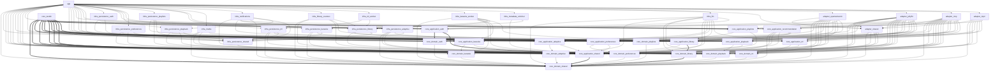

# Module Dependency Graph

Auto-generated from build files. Do not edit manually.

```mermaid
graph TD
    adapter_jellyfin --> adapter_shared
    adapter_jellyfin --> core_domain_shared
    adapter_jellyfin --> core_domain_auth
    adapter_jellyfin --> core_domain_library
    adapter_jellyfin --> core_domain_playback
    adapter_jellyfin --> core_domain_playlists
    adapter_jellyfin --> core_domain_preferences
    adapter_jellyfin --> core_domain_adaptive
    adapter_jellyfin --> core_domain_ml
    adapter_jellyfin --> core_domain_karaoke
    adapter_jellyfin --> core_application_shared
    adapter_jellyfin --> core_application_auth
    adapter_jellyfin --> core_application_library
    adapter_jellyfin --> core_application_playback
    adapter_jellyfin --> core_application_playlists
    adapter_jellyfin --> core_application_preferences
    adapter_jellyfin --> core_application_adaptive
    adapter_jellyfin --> core_application_ml
    adapter_jellyfin --> core_application_karaoke
    adapter_jellyfin --> core_application_recommendation
    adapter_mcp --> adapter_shared
    adapter_mcp --> core_domain_shared
    adapter_mcp --> core_domain_auth
    adapter_mcp --> core_domain_playback
    adapter_mcp --> core_domain_playlists
    adapter_mcp --> core_domain_preferences
    adapter_mcp --> core_domain_adaptive
    adapter_mcp --> core_domain_library
    adapter_mcp --> core_domain_ml
    adapter_mcp --> core_application_shared
    adapter_mcp --> core_application_auth
    adapter_mcp --> core_application_library
    adapter_mcp --> core_application_playback
    adapter_mcp --> core_application_playlists
    adapter_mcp --> core_application_preferences
    adapter_mcp --> core_application_adaptive
    adapter_mcp --> core_application_ml
    adapter_mcp --> core_application_recommendation
    adapter_mpd --> adapter_shared
    adapter_mpd --> core_domain_shared
    adapter_mpd --> core_domain_playback
    adapter_mpd --> core_domain_library
    adapter_mpd --> core_domain_playlists
    adapter_mpd --> core_application_shared
    adapter_mpd --> core_application_playback
    adapter_mpd --> core_application_library
    adapter_mpd --> core_application_playlists
    adapter_opensubsonic --> adapter_shared
    adapter_opensubsonic --> core_domain_shared
    adapter_opensubsonic --> core_domain_auth
    adapter_opensubsonic --> core_domain_library
    adapter_opensubsonic --> core_domain_ml
    adapter_opensubsonic --> core_domain_playback
    adapter_opensubsonic --> core_domain_playlists
    adapter_opensubsonic --> core_domain_preferences
    adapter_opensubsonic --> core_application_shared
    adapter_opensubsonic --> core_application_auth
    adapter_opensubsonic --> core_application_library
    adapter_opensubsonic --> core_application_ml
    adapter_opensubsonic --> core_application_playback
    adapter_opensubsonic --> core_application_playlists
    adapter_opensubsonic --> core_application_preferences
    adapter_shared --> core_domain_shared
    adapter_shared --> core_domain_auth
    adapter_shared --> core_domain_library
    adapter_shared --> core_domain_playback
    adapter_shared --> core_application_shared
    adapter_shared --> core_application_library
    adapter_shared --> core_application_ml
    app --> core_domain_shared
    app --> core_domain_auth
    app --> core_domain_library
    app --> core_domain_playback
    app --> core_domain_adaptive
    app --> core_domain_preferences
    app --> core_domain_playlists
    app --> core_domain_ml
    app --> core_domain_karaoke
    app --> core_application_shared
    app --> core_application_auth
    app --> core_application_library
    app --> core_application_playback
    app --> core_application_adaptive
    app --> core_application_preferences
    app --> core_application_playlists
    app --> core_application_ml
    app --> core_application_karaoke
    app --> core_application_recommendation
    app --> infra_persistence_shared
    app --> infra_persistence_auth
    app --> infra_persistence_library
    app --> infra_persistence_playback
    app --> infra_persistence_adaptive
    app --> infra_persistence_preferences
    app --> infra_persistence_playlists
    app --> infra_persistence_ml
    app --> infra_persistence_karaoke
    app --> infra_media
    app --> infra_notifications
    app --> infra_library_scanner
    app --> infra_ml_worker
    app --> infra_karaoke_worker
    app --> infra_metadata_enricher
    app --> infra_llm
    app --> adapter_shared
    app --> adapter_opensubsonic
    app --> adapter_jellyfin
    app --> adapter_mcp
    app --> adapter_mpd
    core_testkit ==> core_domain_shared
    core_testkit ==> core_application_shared
    core_testkit ==> core_domain_auth
    core_testkit ==> core_application_auth
    core_testkit ==> core_domain_preferences
    core_testkit ==> core_application_preferences
    core_testkit ==> core_domain_playlists
    core_testkit ==> core_application_playlists
    core_testkit ==> core_domain_playback
    core_testkit ==> core_application_playback
    core_testkit ==> core_domain_library
    core_testkit ==> core_application_library
    core_testkit ==> core_domain_adaptive
    core_testkit ==> core_application_adaptive
    infra_karaoke_worker --> core_domain_shared
    infra_karaoke_worker --> core_domain_karaoke
    infra_karaoke_worker --> core_application_shared
    infra_karaoke_worker --> core_application_karaoke
    infra_karaoke_worker --> core_application_library
    infra_karaoke_worker --> infra_persistence_karaoke
    infra_karaoke_worker --> infra_persistence_library
    infra_library_scanner --> core_domain_shared
    infra_library_scanner --> core_domain_library
    infra_library_scanner --> core_application_shared
    infra_library_scanner --> core_application_library
    infra_library_scanner --> infra_persistence_library
    infra_llm --> core_domain_shared
    infra_llm --> core_domain_adaptive
    infra_llm --> core_domain_library
    infra_llm --> core_domain_ml
    infra_llm --> core_domain_preferences
    infra_llm --> core_application_shared
    infra_llm --> core_application_adaptive
    infra_llm --> core_application_preferences
    infra_llm --> core_application_library
    infra_llm --> core_application_ml
    infra_llm --> infra_persistence_adaptive
    infra_media --> core_domain_shared
    infra_media --> core_domain_library
    infra_media --> core_application_shared
    infra_media --> core_application_library
    infra_metadata_enricher --> core_application_shared
    infra_metadata_enricher --> infra_persistence_library
    infra_ml_worker --> infra_persistence_ml
    infra_ml_worker --> infra_persistence_library
    infra_notifications --> core_application_shared
    infra_notifications --> core_application_library
    infra_notifications --> core_application_recommendation
    infra_notifications --> core_application_auth
    infra_notifications --> core_domain_shared
    infra_notifications --> infra_persistence_shared
    infra_notifications --> infra_persistence_playback
    core_application_adaptive --> core_domain_adaptive
    core_application_adaptive --> core_application_shared
    core_application_auth ==> core_domain_auth
    core_application_auth ==> core_application_shared
    core_application_karaoke --> core_domain_karaoke
    core_application_karaoke --> core_application_shared
    core_application_library --> core_application_shared
    core_application_library ==> core_domain_library
    core_application_ml --> core_domain_ml
    core_application_ml --> core_application_shared
    core_application_playback --> core_domain_playback
    core_application_playback --> core_application_shared
    core_application_playlists --> core_domain_playlists
    core_application_playlists --> core_application_shared
    core_application_preferences --> core_domain_preferences
    core_application_preferences --> core_application_shared
    core_application_recommendation --> core_domain_shared
    core_application_recommendation --> core_domain_library
    core_application_recommendation --> core_domain_preferences
    core_application_recommendation --> core_application_shared
    core_application_recommendation --> core_application_library
    core_application_recommendation --> core_application_preferences
    core_application_shared ==> core_domain_shared
    core_domain_adaptive --> core_domain_shared
    core_domain_auth --> core_domain_shared
    core_domain_karaoke --> core_domain_shared
    core_domain_library ==> core_domain_shared
    core_domain_ml --> core_domain_shared
    core_domain_playback --> core_domain_shared
    core_domain_playlists --> core_domain_shared
    core_domain_preferences --> core_domain_shared
    infra_persistence_adaptive --> core_domain_shared
    infra_persistence_adaptive --> core_domain_adaptive
    infra_persistence_adaptive --> core_application_shared
    infra_persistence_adaptive --> core_application_adaptive
    infra_persistence_adaptive --> infra_persistence_shared
    infra_persistence_auth --> core_domain_auth
    infra_persistence_auth --> core_application_auth
    infra_persistence_auth --> infra_persistence_shared
    infra_persistence_karaoke --> core_domain_shared
    infra_persistence_karaoke --> core_domain_karaoke
    infra_persistence_karaoke --> core_application_karaoke
    infra_persistence_karaoke --> infra_persistence_shared
    infra_persistence_library --> core_domain_library
    infra_persistence_library --> core_application_library
    infra_persistence_library --> infra_persistence_shared
    infra_persistence_ml --> core_domain_shared
    infra_persistence_ml --> core_domain_ml
    infra_persistence_ml --> core_application_ml
    infra_persistence_ml --> infra_persistence_shared
    infra_persistence_playback --> core_domain_playback
    infra_persistence_playback --> core_application_playback
    infra_persistence_playback --> core_application_shared
    infra_persistence_playback --> infra_persistence_shared
    infra_persistence_playlists --> core_domain_playlists
    infra_persistence_playlists --> core_application_playlists
    infra_persistence_playlists --> core_application_shared
    infra_persistence_playlists --> infra_persistence_shared
    infra_persistence_preferences --> core_domain_preferences
    infra_persistence_preferences --> core_application_preferences
    infra_persistence_preferences --> core_application_shared
    infra_persistence_preferences --> infra_persistence_shared
    infra_persistence_shared --> core_application_shared
```

Solid arrows (`-->`) = `implementation` dependency

Double arrows (`==>`) = `api` (transitive) dependency
